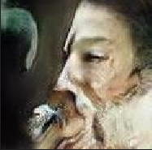

 

<h1><center>本科设计报告</center></h1>

 

 

<center><font size="5">课程名称：<u>&nbsp;&nbsp;&nbsp;&nbsp;&nbsp;&nbsp;人工智能安全
  &nbsp;&nbsp;&nbsp;&nbsp;&nbsp;&nbsp;&nbsp;&nbsp;&nbsp;&nbsp;</u></font></center>

<center><font size="5">姓名学号：&nbsp;&nbsp;<u>&nbsp;胡若凡&nbsp;3200102312&nbsp;</u></font></center>

<center><font size="5">&nbsp;&nbsp;&nbsp;&nbsp;&nbsp;&nbsp;&nbsp;&nbsp;&nbsp;&nbsp;&nbsp;&nbsp;&nbsp;&nbsp;&nbsp;&nbsp;&nbsp;&nbsp;&nbsp;<u>&nbsp;朱靖彦&nbsp;3200104165&nbsp;</u></font></center>

<center><font size="5">学&nbsp;&nbsp;&nbsp;&nbsp;&nbsp;&nbsp;&nbsp;&nbsp;院：<u>&nbsp;&nbsp;&nbsp;&nbsp;&nbsp;&nbsp;&nbsp;&nbsp;&nbsp;计算机学院&nbsp;&nbsp;&nbsp;&nbsp;&nbsp;&nbsp;&nbsp;&nbsp;&nbsp;</u></font></center>

<center><font size="5">专&nbsp;&nbsp;&nbsp;&nbsp;&nbsp;&nbsp;&nbsp;&nbsp;业：<u>&nbsp;&nbsp;&nbsp;计算机科学与技术&nbsp;&nbsp;&nbsp;</u></font></center>

<center><font size="5">&nbsp;&nbsp;指导老师：<u>&nbsp;&nbsp;&nbsp;&nbsp;&nbsp;&nbsp;&nbsp;&nbsp;&nbsp;&nbsp;&nbsp;&nbsp;&nbsp;杨子祺&nbsp;&nbsp;&nbsp;&nbsp;&nbsp;&nbsp;&nbsp;&nbsp;&nbsp;&nbsp;&nbsp;&nbsp;&nbsp;&nbsp;&nbsp;</u></font></center>

<center><font size="5"><u>&nbsp;&nbsp;2023&nbsp;&nbsp;</u>年<u>&nbsp;&nbsp;6&nbsp;&nbsp;</u>月<u>&nbsp;&nbsp;18&nbsp;&nbsp;</u>日</font></center>

<div style="page-break-after:always"></div>


# 																	人工智能安全报告

## 1. 实验目的

### 1.1 AI公平

​	本次实验，我们聚焦于人工智能安全领域有关“公平”的问题。AI的公平性是指与人类的道德价值和伦理准则相一致，避免歧视和不公平现象。

​	针对**数据集**上，公平性的需求指导我们对模型训练使用的数据进行质量检查，以确保数据集的多样性和平衡。例如，如果数据集只有少数族裔或性别的数据，则AI会重复和放大这种先入为主的偏见，从而导致不公平的偏差。

​	而为了优化数据集，一种较好的方案是**合成公平的替代数据**，其要求是利用原始数据集和GAN这类生成工具，由算法重新对数据进行一遍合理的清洗与生成，以此来解决原先数据集中潜在的偏见问题。

### 1.2 实验目标

​	在本次实验，我们选取并学习了关于预处理阶段的公平性提升技术。我们预计完成以下的实验目标

- 阅读、归纳、理解论文：（2021 CVPR）Fair Attribute Classification through Latent Space De-biasing
- 复现、修改实验：对论文所给出的实验进行复现，针对celebA数据集，选择特定的属性，使用GAN生成图片，并测试是否更加公平
- 分析与改进：对论文提出的方法的有效性进行分析，提出针对该方法的不足和我们思考的可创新方案

## 2. 实验环境

### 2.1 数据集

​	由于带有偏见的数据集较难收集，而例如Mnist、CIFAR10这类数据集都不具有明显的偏见性，因此我们本次依旧使用较为常用的celebA数据集。

​	CelebA数据集，即CelebFaces Attribute数据集，中文可译作人脸属性数据集，其包含10,177个名人身份的202,599张人脸图片，每张图片都做好了特征标记，包含人脸bbox标注框、5个人脸特征点坐标以及**40个属性标记**，CelebA由香港中文大学开放提供，广泛用于人脸相关的计算机视觉训练任务，可用于人脸属性标识训练、人脸检测训练以及landmark标记等。我们从官方途径下载了该数据集，下载网址为：[Large-scale CelebFaces Attributes (CelebA) Dataset](https://link.zhihu.com/?target=http%3A//mmlab.ie.cuhk.edu.hk/projects/CelebA.html)

​	在该数据集中，包含三个文件，包括各类属性的统计和使用图片，而在Img文件夹中，使用的是**经过人脸对齐和裁剪**了的图像**img_align_celeba.zip**文件。


​	而本人脸的属性包括：

```html
5_o_Clock_Shadow：刚长出的双颊胡须
Arched_Eyebrows：柳叶眉
Attractive：吸引人的
Bags_Under_Eyes：眼袋
Bald：秃头
Bangs：刘海
Big_Lips：大嘴唇
Big_Nose：大鼻子
Black_Hair：黑发
Blond_Hair：金发
Blurry：模糊的
Brown_Hair：棕发
Bushy_Eyebrows：浓眉
Chubby：圆胖的
Double_Chin：双下巴
Eyeglasses：眼镜
Goatee：山羊胡子
Gray_Hair：灰发或白发
Heavy_Makeup：浓妆
High_Cheekbones：高颧骨
Male：男性
Mouth_Slightly_Open：微微张开嘴巴
Mustache：胡子，髭
Narrow_Eyes：细长的眼睛
No_Beard：无胡子
Oval_Face：椭圆形的脸
Pale_Skin：苍白的皮肤
Pointy_Nose：尖鼻子
Receding_Hairline：发际线后移
Rosy_Cheeks：红润的双颊
Sideburns：连鬓胡子
Smiling：微笑
Straight_Hair：直发
Wavy_Hair：卷发
Wearing_Earrings：戴着耳环
Wearing_Hat：戴着帽子
Wearing_Lipstick：涂了唇膏
Wearing_Necklace：戴着项链
Wearing_Necktie：戴着领带
Young：年轻人
```

### 2.2 使用模型

​	在本次实验中，主要涉及到的模型有ResNet50和Pytorch GAN Zoo。这里对于这两个使用到的模型做一个基础介绍。

#### 2.2.1 ResNet50

​	Resnet50 网络中包含了 49 个卷积层、一个全连接层。其特点是采用残差网络（Residual Network）的结构进行训练，通过引入跨层连接（Shortcut Connection），可以有效地解决深度神经网络在训练过程中遇到的梯度消失问题。此外，ResNet50中还使用了批归一化（Batch Normalization）等技术，可以进一步提高模型的收敛速度和稳定性。

​	ResNet50在许多计算机视觉任务中表现出色，例如图像分类、目标检测和语义分割。同时，它也被广泛应用于其他领域，例如自然语言处理、语音识别等。由于其高效的训练和预测速度以及良好的性能，ResNet50已成为深度学习领域的重要基准模型之一。

#### 2.2.2 PGAN

​	本实验中，关于GAN生成图像的任务，使用的Facebook pretraine的GAN模型。pytorch_GAN_zoo是 Facebook Research 团队开源的一个 PyTorch 实现的 GAN 模型库。该库包含了多种常见 GAN 模型的实现，例如 DCGAN、WGAN、CycleGAN 等等，还包括了一些新型的 GAN 模型。

​	GAN的全称是Generative adversarial network。生成对抗网络是两个网络的组合：生成网络（Generator）负责生成模拟数据；判别网络Discriminator）负责判断输入的数据是真实的还是生成的。生成网络通过不断优化自己生成的数据来使得判别网络无法判断，判别网络则不断优化本身的模型让自己判断得更准确。二者关系形成对抗，不断生成。

### 2.3 环境部署

- 编程软件：Vscode
- 主要框架：PyTorch
- 实验环境：Ubuntu 16.04.6 LTS
- 硬件配置：GeForce GTX 1080 Ti

## 3. 方案设计

### 3.1 论文阅读

​	深入阅读原论文 Fair Attribute Classification through Latent Space De-biasing，包括论文的研究背景、算法思路、实验设置和结论等内容。

​	展开而言，首先，在本部分需要了解基于属性的分类任务中存在的偏见问题以及现有算法的局限性。进一步了解偏见问题和敏感属性的产生原因，明确算法设计的重要性。其次，需要详细了解论文提出的算法框架，包括文章对GAN的利用的具体实现细节，以及相应的数学推导过程。最后，了解论文中的实验设置和结果。重点关注数据集的构建方法、实验评估指标、实验设置及参数等，并且需要对实验数据进行详细的分析和解释。

### 3.2 对比实验

​	针对本次实验设计，我们打算开展一次对比性质的实验，对比单独进行数据增强的FairGAN方法与本论文中成对生成数据对象对公平性的影响。

​	展开而言，我们首先会选择基于属性分类的数据集celebA作为我们实验的数据集。然后，我们将采用两种方法来进行公平性的增强：一种是相对较为常用的FairGAN方法，在此基础上单独进行数据增强；另一种是本论文提出的基于成对生成数据对象的去偏置方法

​	在实验中，我们将分别应用这两种方法来处理数据集，并使用相关评估指标（比如分类准确率、各个类别的分类指标和公平性指标等）来衡量其效果和优劣。同时，我们将考虑不同参数的设置和调整，以探究不同参数对实验结果的影响。

### 3.3 模型修改	

​	在这一部分，我们将会对模型进行细致的分析，分析其中的一些不足缺陷和我们设计的修改方案。

​	具体而言，比如**隐空间的探讨**，在论文中提到的LSD算法，其基本思想是通过学习一个去偏置的隐空间来实现公平性增强。虽然这种方法在实验中取得了很好的结果，但是隐空间的维度很高，这对于数据量较小的问题可能会导致过拟合的问题。

​	再比如，对分类器**进行鲁棒性分析**，我们的课堂上曾对**对抗样本搜索**有着详细的介绍，而本次实验训练出的分类器显然是一个白盒模型，我们希望探索利用较为简单的方式训练对抗样本，其正确率是否会有一定的下降。

### 3.4 结论分析

​	在本部分，我们将对本次实验进行一个综合分析，概括论文的核心思想和数学推理，对比分析两种GAN的公平性，探索总结隐空间和模型鲁棒性方面。并总结本次实验的心得与不足，记录实验中我们碰到的各种困难，提出我们的一些思考与看法。

## 4. 方案创新性

对于这篇论文而言，作者的创新性包括：

* 从隐变量角度出发，提出了利用分类器在隐空间的超平面生成成对数据的方法
* 使用GAN生成成对数据，分离隐藏在数据中的数据相关性，增强数据公平性

在本次实验中，我们认为自己有如下的方案创新性：

- 开展**对比实验**，我们将会对比本文与Fair GAN，探索成对生成图片是否对公平性有更好的提升影响
- 开展**隐空间探讨**，我们将会研究本方法中GAN有关的隐空间，探索其维度数对生成图片的一定影响
- 开展**鲁棒性分析**，我们将会结合对抗样本攻击，去探索训练出的新分类器是否具有良好的鲁棒性

## 5. 代码与分析

### 5.1 实验介绍

​	本次代码主要共分为四大模块部分，分别是：

- 图像预处理模块：对于数据集的图像做格式统一
- 分类器训练模块：利用原数据集合或GAN生成的公平性图像，生成分类器
- 图像生成器模块：利用GAN模块，生成图像
- 隐变量修改模块：本文的**核心思想**，通过对隐变量的修改，达到生成图像的公平性。

​	本次实验的代码**步骤顺序**为：图像初始化->基于原图像，训练baseline分类器->生成GAN图像->针对GAN图像，使用baseline的分类器得到的结果，训练基于隐变量的分类器->根据分类器，调整隐变量->根据调整后的隐变量，生成公平性图片

### 5.2 图像预处理

​	预处理部分需要将图片进行大小格式的统一。在安装库后，进行了相关的裁剪，这里简单记录一下代码：它使用了一个预定义的中心点 (cx, cy) 来指定裁剪区域的位置，然后从该点向四周各走64，裁剪一个大小为 128x128 的矩形

```python
# 导入必要的库
import numpy as np
import os
import imageio
from PIL import Image

# 定义裁剪函数
def crop_images(inputPath, outputPath, size=128):
    # 遍历输入文件夹中的所有 JPEG 文件，并返回文件名列表
    img_list = [f for f in os.listdir(inputPath) if os.path.splitext(f)[1] == ".jpg"]

    # 获取图片数量
    nImgs = len(img_list)

    # 如果输出文件夹不存在，则创建它
    if not os.path.isdir(outputPath):
        os.mkdir(outputPath)

    # 定义中心点坐标
    cx = 121
    cy = 89

    # 循环处理每张图片
    for index, item in enumerate(img_list):
        path = os.path.join(inputPath, item)

        # 打开图片，转换为 RGB 格式，然后将其转换为 NumPy 数组
        with open(path, 'rb') as f:
            img = Image.open(f)
            img = np.array(img.convert('RGB'))

            # 裁剪图片
            img = img[cx - 64:cx+64, cy-64:cy+64]

            # 将裁剪后的图片保存到输出文件夹中
            path = os.path.join(outputPath, item)
            imageio.imwrite(path, img)

# 主函数
if __name__ == "__main__":
    # 调用裁剪函数，传入输入文件夹路径和输出文件夹路径
    crop_images("data/celeba/img_align_celeba/", "data/celeba/img_align_celeba/")

```

### 5.3 分类器训练

​	本次实验主要使用的是 **ResNet50**，下面对训练代码的重要代码部分，进行一个学习分析

```python
class attribute_classifier():
    
    def __init__(self, device, dtype, modelpath = None, learning_rate = 1e-4):
        #print(modelpath)
        self.model = ResNet50(n_classes=1, pretrained=True)
        self.model.require_all_grads()
        self.optimizer = optim.Adam(self.model.parameters(), lr=learning_rate)
        self.device=device
        self.dtype = dtype
        self.epoch = 0
        self.best_acc = 0.0
        self.print_freq=100
        if modelpath!=None:
            A = torch.load(modelpath, map_location=device)
            self.model.load_state_dict(A['model'])#torch.load(modelpath,map_location=device) )
            if (self.device==torch.device('cuda')):
                self.model.cuda()
            self.optimizer.load_state_dict(A['optim'])
            self.epoch = A['epoch']
            self.best_acc = A['best_acc']
```

​	在该部分中，定义了一个名为 attribute_classifier 的类，用于实现属性分类器。在初始化方法 `__init__` 中，通过传递设备、数据类型、模型路径和学习率等参数来创建属性分类器对象。初始化过程中会进行以下操作：

- 创建一个 **ResNet50 模型**，该模型具有1个输出类别，并**使用预训练的权重**。
- 创建一个 **Adam 优化器**，并将模型的参数传递给优化器。
- 设置其他实例变量，如设备、数据类型、训练周期数、最佳准确率和打印频率。

```python
def train(self, loader, weighted=False, weight_dict=None):
    """Train the model for one epoch"""
    
    self.model.train()
    train_loss = 0
    self.model = self.model.to(device=self.device, dtype=self.dtype)
    for i, (images, targets) in enumerate(loader):
        images, targets = images.to(device=self.device, dtype=self.dtype), targets.to(device=self.device, dtype=self.dtype)
        domain = targets[:, 1]
        targets = targets[:, 0]
        
        self.optimizer.zero_grad()
        outputs, _ = self.forward(images)
        lossbce = torch.nn.BCEWithLogitsLoss()
        loss = lossbce(outputs.squeeze(), targets) 
        loss.backward()
        self.optimizer.step()

        train_loss += loss.item()
        if self.print_freq and (i % self.print_freq == 0):
            print('Training epoch {}: [{}|{}], loss:{}'.format(
                  self.epoch, i+1, len(loader), loss.item()), flush=True)
    
    self.epoch += 1
```

​	定义了一个训练方法 `train`，用于对模型进行一次完整的训练周期。方法中会进行以下操作：

- 将模型设置为**训练模式**，并将训练损失初始化为0。
- 遍历数据加载器中的每个批次，将图像和目标值移动到指定设备和数据类型上。
- 重置优化器的梯度。
- 进行一次正向传播并计算损失。
- 执行反向传播和优化步骤。
- 更新训练损失，并在达到指定的打印频率时输出当前训练进度。

```python
def get_scores(self, loader, labels_present=True):
    if (self.device==torch.device('cuda')):
        self.model.cuda()
    self.model.eval()  # set model to evaluation mode
    acc = 0.0
    y_all = []
    scores_all = []
    with torch.no_grad():
        for (x, y) in loader:
            x = x.to(device=self.device, dtype=self.dtype)  # move to device, e.g. GPU
            y = y.to(device=self.device, dtype=torch.long)
            
            scores, _ = self.model(x)
            scores = torch.sigmoid(scores).squeeze()
            
            y_all.append(y.detach().cpu().numpy())
            scores_all.append(scores.detach().cpu().numpy())
        y_all = np.concatenate(y_all)
        pred_all = np.concatenate(scores_all)
    
    return y_all, pred_all
```

​	定义了一个获取模型预测结果的方法 `get_scores`，用于在给定数据加载器上获取模型的预测结果和真实标签。方法中会进行以下操作：

- 将模型移到指定设备上，并将其设置为**评估模式**。
- 初始化变量 `y_all` 和 `scores_all`，用于存储所有真实标签和预测分数。
- 遍历数据加载器中的每个批次，并将输入数据移动到指定设备上。
- 对输入数据进行正向传播，获取模型的预测分数。
- 将真实标签和预测分数存储在对应的列表中。
- 将 `y_all` 和 `scores_all` **转换为 numpy 数组并返回**。

### 5.4 图像生成器

​	本部分调用了Facebook预训练的GAN模型，其中主要有两个函数，作用分别为：`generate_orig_images` 函数用于生成原始图像，`generate_pair_images` 函数用于生成图像对

```python
def generate_orig_images(model, num_images):
    # 生成原始图像函数

    noise, _ = model.buildNoiseData(num_images)
    # 通过调用模型的 buildNoiseData 方法生成指定数量的噪声数据

    print('Generating new images. Latent vectors stored at record/GAN_model/latent_vectors.pkl')
    # 打印提示信息，表示正在生成新的图像，并将潜在向量存储在 record/GAN_model/latent_vectors.pkl 文件中

    import pickle
    with open('record/GAN_model/latent_vectors.pkl', 'wb+') as f:
        pickle.dump(noise.detach().cpu().numpy(), f)
    # 使用 pickle 库将噪声数据从 GPU 上的张量类型转换为 numpy 数组，并将其保存到 'latent_vectors.pkl' 文件中
    # 这样保存噪声数据的目的是为了后续可以重复生成相同的图像

    out_dir = 'data/fake_images/AllGenImages/'
    utils.make_dir('data/fake_images')
    utils.make_dir(out_dir)
    # 设置生成图像的输出目录，并确保该目录存在

    batch_size = 64
    N = int(num_images / batch_size)
    if num_images % batch_size != 0:
        N += 1
    count = 0
    # 根据指定图像数量计算需要进行多少次生成图像的循环

    for ell in range(N):
        with torch.no_grad():
            generated_images = model.test(noise[ell * batch_size:(ell + 1) * batch_size])
        # 使用模型的 test 方法生成指定数量的图像

        for i in range(generated_images.shape[0]):
            grid = torchvision.utils.save_image(generated_images[i].clamp(min=-1, max=1),
                                                 out_dir + 'gen_' + str(count) + '.jpg',
                                                 padding=0,
                                                 scale_each=True,
                                                 normalize=True)
            count += 1
    # 循环生成图像，并将生成的图像保存到指定的输出目录中

    print('All images generated')
    # 打印提示信息，表示所有图像已经生成完毕


def generate_pair_images(model, latent_vectors, out_dir):
    # 生成图像对的函数

    print('Generating image pairs.')
    # 打印提示信息，表示正在生成图像对

    noise = torch.Tensor(latent_vectors)
    # 根据给定的潜在向量创建噪声张量

    utils.make_dir(out_dir)
    # 确保输出目录存在

    batch_size = 64

    num_images = noise.shape[0]
    N = int(num_images / batch_size)
    if num_images % batch_size != 0:
        N += 1
    count = 0
    # 根据潜在向量的数量计算需要进行多少次生成图像的循环

    for ell in range(N):
        with torch.no_grad():
            generated_images = model.test(noise[ell * batch_size:(ell + 1) * batch_size])
        # 使用模型的 test 方法生成指定数量的图像

        for i in range(generated_images.shape[0]):
            grid = torchvision.utils.save_image(generated_images[i].clamp(min=-1, max=1),
out_dir + 'gen_' + str(count) + '.jpg',padding=0,scale_each=True,normalize=True)
            count += 1
    # 循环生成图像，并将生成的图像保存到指定的输出目录中

    print('All images generated.')
    # 打印提示信息，表示所有图像对已经生成完毕
```

### 5.5 隐变量修改

​	在经过了第一轮GAN图像的生成和baseline对其的标注后，文章的核心部分则集中在了下面的隐变量修改方面。

​	下面结合代码和公式进行分析：


$$
h_t(z') = h_t(z), \\
h_g(z') = - h_g(z)
$$
​	本代码的思路是，首先载入对于GAN第一轮生成图像，以及它们被baseline的分类结果，此时，便拥有了 **数据集+标签**。此时，可以训练两个针对于隐变量的分类器 **clf_g与clf_a（clf_g是普通属性，clf_a是敏感属性，任务目标是去除g和a之间的虚假关联）**。实现时，将对应的 $z$ 沿着平行于 $clf_g$ 的决策边界（即目标任务超平面）的方向移动，直至跨越  $clf_a$ 的决策边界（即敏感属性超平面）；在选择对应的 $z'$ 时，一般是令 $z$  和 $z'$ 到敏感属性超平面的距离相等、连线与目标任务超平面平行。

​	此时，便能够得到了消除关联属性的公平图片


```python
"""
用于计算GAN生成的图像的潜在向量(latent vector)
并进行一些变换 例如将图像向量沿给定属性分类器决策边界的垂直方向进行投影或反投影、
沿给定属性分类器决策边界的垂线进行投影或反投影等
并将结果保存到指定的文件中
"""
if __name__=="__main__":
    
    opt = parse_args.collect_args_linear()
    np.random.seed(opt['random_seed'])
    
    #载入位于'record/GAN_model/latent_vectors.pkl'路径下的Gan生成的图像数据。
    #这里是直接用初始的GAN生成的175000图
    X = pickle.load(open('record/GAN_model/latent_vectors.pkl', 'rb')) 
    #载入处理好的假图像数据g和a，分别对应生成的图像是否包含目标保护属性和目标属性。
    #这里是用两次get_scores得到的假图像数据的分类结果
    g = pickle.load(open('data/fake_images/all_'+opt['prot_attr_name']+'_scores.pkl', 'rb')) 
    a = pickle.load(open('data/fake_images/all_'+opt['attr_name']+'_scores.pkl', 'rb'))

    X_train = X[:10000, :]
    g_train = g[:10000]
    a_train = a[:10000]
    
    X_val = X[10000:15000, :]
    g_val = g[10000:15000]
    a_val = a[10000:15000]
    #这里的X写法是由于其维度不同
    #将前10000个样本作为训练集，10000-15000个样本作为验证集。
    
    print(a_val.sum())
    print(opt)

    #构建保护属性的分类器clf_g。
    #使用linearSVC,训练数据是X_train,也就是latent-z，标签是二类器的标注g_train
    #coef_是分类器的权重向量，intercept_是分类器的截距。
    #通过对这两个属性进行处理，可以使得分类器的权重向量满足单位长度，并且截距也得到适当的缩放
    clf_g = svm.LinearSVC(max_iter=500000) 
    clf_g.fit(X_train, g_train)

    clf_g_norm = np.linalg.norm(clf_g.coef_)
    clf_g.coef_ = clf_g.coef_/(clf_g_norm)
    clf_g.intercept_ = clf_g.intercept_/clf_g_norm

    #两个针对z的分类器一次性训练完成
    clf_a = svm.LinearSVC(max_iter=500000) 
    clf_a.fit(X_train, a_train)

    clf_a_norm = np.linalg.norm(clf_a.coef_)
    clf_a.coef_ = clf_a.coef_/(clf_a_norm)
    clf_a.intercept_ = clf_a.intercept_/clf_a_norm
    
    #计算g与a之间的正交距离
    #并将clf_g分类器的法向量沿该方向进行缩放，得到投影方向上的单位向量g_perp_a。
    g_perp_a = clf_g.coef_ - (np.sum(clf_g.coef_* clf_a.coef_))*clf_a.coef_

    g_perp_a = g_perp_a/np.linalg.norm(g_perp_a)

    #计算clf_g法向量与g_perp_a的夹角sin_theta和cos_theta。
    cos_theta = np.sum(clf_g.coef_*clf_a.coef_)
    sin_theta = np.sqrt(1 - cos_theta*cos_theta)
    
    
    #下面进行的是对向量的数学变换,达到消除偏见
    
    #X_all数组表示图像向量沿反投影方向反投影后得到的新向量
    #X_on_hyperplane数组表示图像向量沿投影方向投影后得到的新向量
    #X_perp数组表示图像向量沿法向量方向进行反射后得到的新向量
    #X_perp_on_hyperplane数组表示图像向量沿法向量方向进行投影后得到的新向量
    X_all = np.zeros((160000, X.shape[1]))
    X_on_hyperplane = np.zeros((160000, X.shape[1]))
    X_perp = np.zeros((160000, X.shape[1]))
    X_perp_on_hyperplane = np.zeros((160000, X.shape[1]))

    for j in range(15000, 175000):
        x = X[j]
        dist = np.sum(clf_g.coef_ * x) + clf_g.intercept_
        #将原图像向量减去两倍正交距离除以sin_theta的投影方向向量g_perp_a，得到反投影后的新向量X_all
        X_all[j-15000] = x - ((2*dist)/sin_theta)* g_perp_a
        #将原图像向量减去正交距离除以sin_theta的投影方向向量g_perp_a，得到沿投影方向的向量X_on_hyperplane
        X_on_hyperplane[j-15000] = x - ((dist)/sin_theta)* g_perp_a
        #将原图像向量减去两倍正交距离乘以clf_g法向量的内积，得到反射后的新向量X_perp
        X_perp[j-15000] = x - ((2*dist)*clf_g.coef_)
        #将原图像向量减去正交距离乘以clf_g法向量的内积，得到沿法向量方向的向量X_perp_on_hyperplane
        X_perp_on_hyperplane[j-15000] = x - ((dist)*clf_g.coef_)
    
    #保存处理后图像向量的路径    
    orig_save = 'record/GAN_model/'
    make_dir(orig_save)  
    make_dir(orig_save+'perp')
    make_dir(orig_save+'perp_on_hyperplane')
    make_dir(orig_save+'on_hyperplane')
    
   #用pickle库保存处理后的向量分别到指定路径下的四个文件中，可以进行后续使用。
   #之所以有4个是因为作者设计了更多的additional expriment
    with open(orig_save+'latent_vectors_'+opt['attr_name']+'.pkl', 'wb+') as handle:
        pickle.dump(X_all, handle)

    with open(orig_save+'perp/latent_vectors_'+opt['attr_name']+'.pkl', 'wb+') as handle:
        pickle.dump(X_perp, handle)

    with open(orig_save+'on_hyperplane/latent_vectors_'+opt['attr_name']+'.pkl', 'wb+') as handle:
        pickle.dump(X_on_hyperplane, handle)
    
    with open(orig_save+'perp_on_hyperplane/latent_vectors_'+opt['attr_name']+'.pkl', 'wb+') as handle:
        pickle.dump(X_perp_on_hyperplane, handle)
```

## 6. 实验结果与分析

### 6.1 基础结果分析

​	针对本次代码的结果分析如下，我们选取了实验中预先设置好的两个属性：smiling与male，其中smiling是normal_attribute，而male是protected_attribute。也就是说，我们的任务目标是消除性别对于smiling属性的影响。

​	下面我们对于实验的重要部分进行一个分析：

- Baseline分类器，训练完成


- Generated-image，生成完成


- Linear.py对于隐变量敏感性的消除，完成


- 对于文中提到的几个重要模块，我们都完成了实现，然后对于公平性的衡量指标，这里得到的对比是针对其提到的四个属性展开的

  - AP (Average Precision，平均精确率)：平均精确率是一个常用的信息检索度量。它基于预测结果中的排序，衡量正例被正确预测的程度。AP越高，表示模型对正例的预测越准确。
- DEO (Disparate Error Odds，不平等错误几率)：不平等错误几率是衡量模型在不同子群体之间是否存在不公平现象的指标。它计算了不同子群体中误分类样本的比率。较低的DEO值表示模型在不同子群体之间具有较小的公平性差异。
  - BA (Balanced Accuracy，平衡准确率)：平衡准确率是一个综合考虑正例和负例分类准确率的度量。它是正例和负例分类准确率的平均值，适用于不平衡数据集。较高的BA值表示模型对正负例分类都有较好的准确率。
- KL (Kullback-Leibler Divergence，KL散度)：KL散度衡量两个概率分布之间的差异程度。较低的KL散度值表示模型在属性预测中具有较好的一致性和稳定性。

~~~
Validation results:
AP : {:.1f} +- {:.1f} 98.29581621226193 0.13859157896049082
DEO : {:.1f} +- {:.1f} 4.298866463002543 1.2881993820591298
BA : {:.1f} +- {:.1f} 0.43447115237582185 0.4077993990446219
KL : {:.1f} +- {:.1f} 0.03568828937260193 0.07137657874520387
Test results:
AP : {:.1f} +- {:.1f} 98.26205231066498 0.1368571252447814
DEO : {:.1f} +- {:.1f} 3.9843146870810697 1.175719200722852
BA : {:.1f} +- {:.1f} -0.032535493041947056 0.3907681175973626
KL : {:.1f} +- {:.1f} 0.036977099684920675 0.07395419936984135
~~~

|      | Baseline | Model      |
| ---- | -------- | ---------- |
| AP   | 98.50    | 98.29-下降 |
| DEO  | 4.08     | 3.83-下降  |
| BA   | 0.56     | 0.45-下降  |
| KL   | 0.04     | 0.02-下降  |

### 6.2 延申：隐变量理论分析

​	对于两种二分类属性来说，他们交错可以产生四种不同的情况（如下）。

| 属性A/属性B | B = 0 | B = 1 |
| ----------- | ----- | ----- |
| A = 0       | 情形a | 情形b |
| A = 1       | 情形c | 情形d |

​	含有偏见的隐变量就是这两种属性在数据集中的相关系数。当相关系数偏移0值较远时，说明两个属性相关，体现在数据集中，就是以上情形ad或者情形bc的数量，大幅领先另外两种情形。分类器在训练时，就有可能会学习到这种隐变量，导致模型存在偏见。因此平衡数据集，使得四种情形均匀分布，就能改善数据集的公平性，从而改善模型的公平性。

​	在本文中，利用隐空间超平面的理论，作者提出可以利用分类器找到某一种属性的超平面（比如属性A），然后沿平行于超平面A的方向将属性B取反，生成成对的一组数据。这样做就使得情形a和情形b的数量相等，情形c和情形d的数量相等，这样数据集中属性A和B就不再相关，消除了对A的B偏见。

这样做有如下的好处：

1. 线性变换，操作简单，快速生成成对数据，计算成本小。
2. 生成的图像与原始图像相似，只是某个属性取反，能够较好地贴近现实图像，真实性强。
3. 从实验数据来看，消除偏见的效果优秀。

这个方法的缺点有：

1. 假设了分类的决策边界是一个超平面。实际决策边界大多非线性，如果是较为复杂的超几何曲面，那么投影的方法会导致生成的图像失真，甚至有可能两次越过决策边界，导致属性不能取反。我们的实验中，一个不太成功的样例如下图。

   

2. 对于三分类及以上的问题，决策边界会更加复杂，该方法的失败可能性会大大增加。

3. 需要预先设定好这两种存在偏见的属性。对于大型模型系统来说，存在很多偏见，往往不容易自动检测并纠错，需要结合其他方法。

### 6.3 延申：方法对比

​	与我们复现的LSD方法相同，FairGAN的目标是生成具有公平性的样本，即生成的样本在某些特定属性上不会产生偏见或歧视。为了实现这一目标，FairGAN期望产生公平的数据集，在敏感属性上统计均等，在这个数据集上训练模型，使得模型能够准确分类，并且满足公平性要求。


​	在上图中，判别器$D_1$用于辨别数据的真伪，判别器$D_2$用于识别数据的敏感性，生成器$G_{Dec}$要学会欺骗两个判别器来合成数据，使得合成的数据不含敏感属性，并且保持其真实性，满足准确分类和公平的要求。

​	与FairGAN对比，LSD使用在隐空间上平行于普通属性超平面位移的方法，来生成去敏感属性的数据样本，是一种原数据的改进，而FairGAN则是利用GAN生成新数据。从这个意义上来说，LSD生成的图像与原始图像更为相似，更符合真实性的特征。下面前两份图片分别是LSD论文中给的样例和我们自己生成的样例，第三份图片是通过FairGAN生成的样例，可以看出，在真实性上，LSD更好。


​	此外，从计算复杂性上考虑，FairGAN需要用到较多的损失函数，计算成本较大，相比之下，LSD的基于隐空间上的位移，使用的运算大多是线性运算，较为快速，并且训练基础的分类器也较为简单，整体运算成本较低。即使实在CelebA这样大型的数据集上，运行速度也比较快。

​	从实验的实际结果上看，FairGAN在消除性别差异的效果上也不如LSD。

| 指标/方法  | FairGAN | FairGAN | LSD  | LSD    |
| ---------- | ------- | ------- | ---- | ------ |
| 性别       | male    | female  | male | female |
| FPR        | 0.52    | 0.26    | 0.22 | 0.39   |
| FNR        | 0.18    | 0.41    | 0.06 | 0.27   |
| Error      | 0.3     | 0.28    | 0.21 | 0.18   |
| Error rate | 0.22    | 0.22    | 0.2  | 0.2    |

### 6.4 延申：对抗样本攻击

​	为了测试训练的分类器的稳定性，可以采用对抗样本攻击的策略。以下是一个用PGD对抗样本攻击LSD分类器的例子。

~~~python
def l_infinity_pgd(model, tensor, gt,epsilon=30./255, target=None,iter=50, show=True):
    # 图片归一化
    norm=transforms.Compose([
        transforms.Normalize((0.1307,), (0.3081,))
        ])

    delta = torch.zeros_like(tensor, requires_grad=True).cuda()
    opt = optim.SGD([delta], lr=10)
	
    # 进行迭代PGD攻击
    for t in range(iter):
        pred = model(norm(tensor + delta))
        # 有/无目标攻击
        if target is None:
            loss = -nn.CrossEntropyLoss()(pred, torch.LongTensor([gt]))
        else:
            loss = loss = -nn.CrossEntropyLoss()(pred, torch.LongTensor([gt]))
            + nn.CrossEntropyLoss()(pred, torch.LongTensor([target]))
        if t % 10 == 0:
            print(t, loss.item())
		# 累积梯度，反向传播
        opt.zero_grad()
        loss.backward()
        opt.step()
        delta.data.clamp_(-epsilon, epsilon)
	
    # 打印对抗样本的预测正确率
    print("True class probability:", nn.Softmax(dim=1)(pred))
    cnn_eval(norm(tensor+delta))
    
    return tensor + delta

if __name__=="__main__":
    opt = parse_args.collect_args_main()
    attr_list = utils.get_all_attr()
    attr_name = attr_list[opt['attribute']]
    
    #print(attr_name)
    model_path = "record/baseline/Smiling/best.pth"

    # 该函数返回将图片转化为tensor的Dataloader
    train = create_dataset_actual(
        opt['data_setting']['path'],
        opt['data_setting']['attribute'],
        opt['data_setting']['protected_attribute'],
        opt['data_setting']['params_real_train'],
        opt['data_setting']['augment'],
        CelebaDataset,
        number=opt['number'])
    
    iterator = iter(train)

    # 从迭代器中获取一个样本
    sample = next(iterator)
    # 读取之前训练好的模型参数
    model = attribute_classifier(opt['device'], opt['dtype'], modelpath=model_path)
    # 进行对抗样本攻击
    l_infinity_pgd(model.model, sample[0], attr_name)
~~~

​	通过交叉熵损失函数对之前训练好的模型`best.pth`进行攻击，可以测试其鲁棒性与稳定性。我们觉得该模型需要在鲁棒性上做一定的提高，采取一定的防御机制。这也契合了稳定得的统一模型的需求。

## 7. 总结与思考

​	这篇论文利用分类器在隐空间的超平面，提出了一种生成成对数据的方法，通过对抗生成网络(GAN)成功生成了成对数据，消除了数据集上存在的偏见，提升了数据集的公平性。这种方法虽然实现上比较简单，但是思路上具有较好的创新性，在实践上又具有良好的效果，为解决人工智能公平性的问题提出了一种方法。

​	我们成功复现了这个实验，运用了代码样例中为我们提供的两种属性进行了实验，得到了和作者一样的结果，成功提高了公平性准则，虽然在一定程度上对于正确性有所降低。并且，我们在实验结果的基础上展开分析，得出了一定的结论。针对这种方法，我们也思考出了一些改进的思路：

* 可以结合偏见检测技术，识别出数据集中可能存在的公平性问题，对存在相应属性的数据进行纠偏，实现数据集纠偏的自动化。
* 可以在隐空间的基础上探索更为复杂的超几何曲线结构，用更好的模型去拟合决策边界，提高生成成对数据的准确性。
* 进行更多方面的实验，将属性扩展到更多方面（物品的公平性、色彩的公平性等等），也可以将该思路扩展到更多领域，并验证可行性，以提升其在实践方面的价值。
* 对于该技术，既然是在人工智能安全领域之中，我们也需要考虑对于其鲁棒性能方面加以更好的保护，我们利用课堂上提到过的对抗样本攻击设计了实验。我们得出结论，在该目标分类器的结果上，也需要添加一定的防御机制，来保证模型的稳定性。

​    AI安全公平性是AI领域中非常重要的问题，它关乎到个体隐私、社会公平和道德伦理等多方面的问题。作为未来AI领域的从业者，我们都应该培养出一份对社会、对用户、对道德伦理的敬畏之心，在尽可能征得用户同意的前提下，确保AI技术的安全公平性，同时为AI技术在人类社会的应用贡献自己的力量。